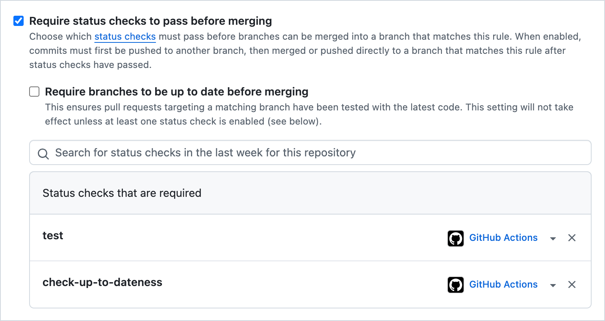

# check-up-to-dateness

A GitHub action to check whether a [merge group] PR is up to date relative to its base branch

Often, GitHub workflows are configured to run the same jobs (e.g., tests) on both `pull_request` and `merge_group` events. But if a PR is based on the head of it base branch and the tests pass on the `pull_request` event, there should be no need to rerun the tests on the `merge_group` event.

This action can be used to determine whether a PR is based on the head of its base branch and thus whether expensive jobs can be skipped.

## Intended use

1. Add a job like the following to your GitHub workflow:
   ```yml
   check-up-to-dateness:
     outputs:
       is-up-to-date: ${{ steps.main.outputs.is-up-to-date }}
     runs-on: ubuntu-latest
     steps:
       - id: main
         uses: trailofbits/check-up-to-dateness@main
   ```
2. For any job you want to skip when merging, add the following:
   ```yml
   my-job:
     needs: [check-up-to-dateness]
     if: needs.check-up-to-dateness.outputs.is-up-to-date != 'true'
   ```
3. Under "Settings" -> "Branches" -> "Branch protection rules" -> "Require status checks to pass before merging" -> "Status checks that are required", add the job that you created in step 1, e.g.:
   <br>
   This final step ensures that if an error occurs in `check-up-to-dateness`, it will not cause a PR to be merged.

[merge group]: https://docs.github.com/en/repositories/configuring-branches-and-merges-in-your-repository/configuring-pull-request-merges/managing-a-merge-queue
